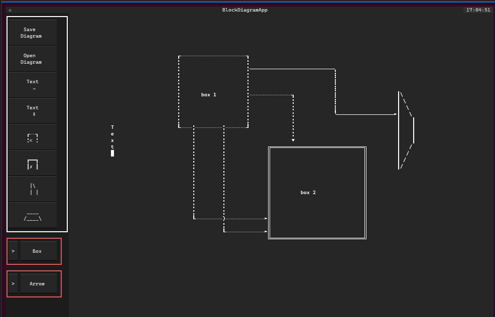
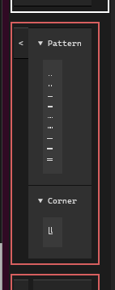
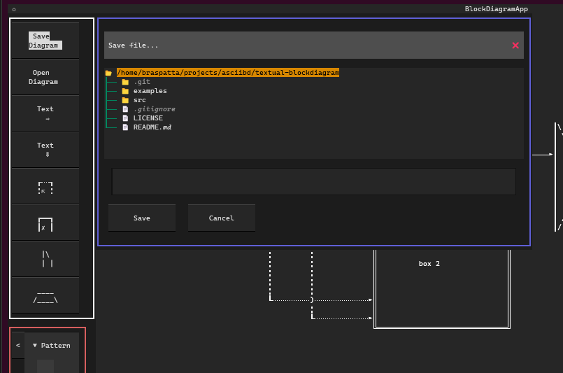

# textual-blockdiagram
Block diagram console application based on textual framework

This is a work in progress and still requires a lot of development.

TODO: convert into a package..




## Usage

```
python blockdiagram.py <directory>
```

## Pattern selection


## Save and Open files
The tool saves the diagrams as a .json which contains the diagram as a comment and the required metadata for later editing.

